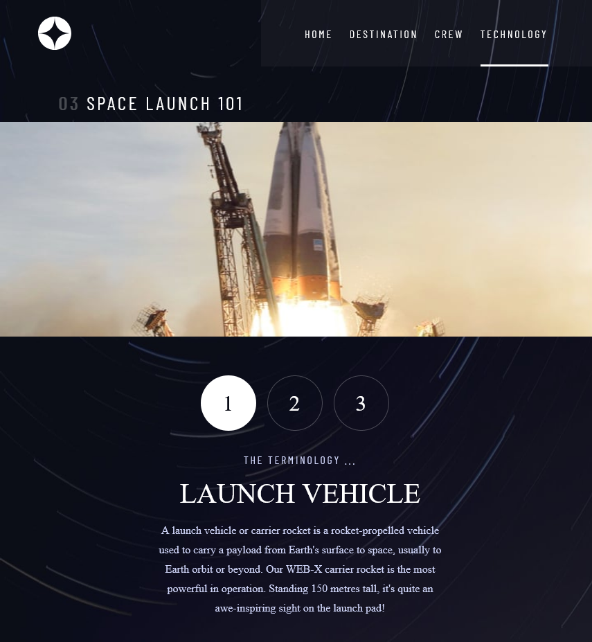

# Objective

Create a website from the design of [**Frontend Mentor**](https://www.frontendmentor.io/challenges/space-tourism-multipage-website-gRWj1URZ3)

## <ins>Frontend Mentor</ins>

### Website

Website providing details about space destinations, crew members, and technologies.

### Challenges

- **Main Challenge**: Your challenge is to build out this multi-page space tourism website and get it looking as close to the design as possible.
- **Additional Challenges**:
    - View the optimal layout for each of the website's pages depending on their device's screen size
    - See hover states for all interactive elements on the page
    - View each page and be able to toggle between the tabs to see new information

### Provided by Frontend Mentor

- Figma Design of website for Desktop, Mobile, and Tablet
- `data.json` file to populate website
- `assets` folder with images for website
- `*.html` files of what the layout of the website.

## <ins>Technologies</ins>

### Run
`yarn start`

or

`npm start`

### Languages
- JavaScript
- HTML
- CSS

### Library/Frameworks/Packages
- React
- React-Bootstrap
- react-router-dom

## Features
- Toggles information display
- Navigation between pages
- Sidebar on mobile screen size
- Hover effect on tabs and navbar

## <ins>Challenges</ins>
- dynamically adding images from json file into img tags src.
    - Example: `"./assets/destination/image-moon.png"`
    - Situation: the webpack that comes with create-react-app does not allow the image string to be used as it is. 
    - Solution: Break the string into the url path to the image and the image name.
        - Created a separate array just for the images
        - Slice the images path name to only include the image file name
            - `['/image-moon.png', ... ]`
        - `src={require(PATH + IMAGE Name)}` PATH = the path to the image

# Images

**Home**

**Destination**

**Crew**

**Technology**

**Sidebar**

